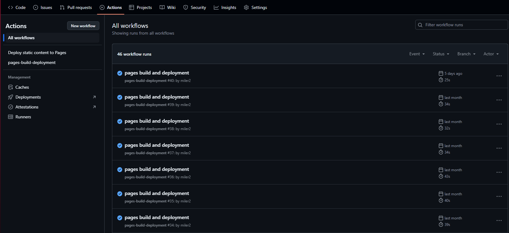

[*Go back to the index*](README.md)  

# Index
- [Installation](#installation)
    - [dependencies](#dependencies)
- [Workspace](#workspace)
    - [How to create a workspace](#how-to-create-a-workspace)
- [Commands](#commands)
- [Static websites](#static-websites)
    - [Static website with GitHub](#static-website-with-github)
        - [Angular-cli-pages](#angular-cli-pages)
- [Official documentation](#official-documentation)

# INSTALLATION

This guide will show you how to install the version 16 of angular. Even tho the later versions are different in how they manage the process of the installation, this readme is good for guidence regardless and will show you some important things to take in account on the installation and usage of Angular. Hope it is useful.

In order to use angular, we will need node.js, npm and angular cli. First we will need to install node.js, and we will select npm in the installation:


When it is installed, we will install angular cli with the following command:

```
npm install -g @angular/cli@16 
```

Here we are specifying that we want the version 16.

## Dependencies:

To install all the dependences of this project you can just use the following command:

```
npm install
```

This tells the project to install all the depencences that are listed in the package.json file that stores all the dependences needed for the project.

When you install any dependency for the first time you should use the argument **--save**, which tells the command to save the dependency in the file package.json too, and store it for future downloads (for the command "npm install" discussed earlier).

- ngx-cookie-service

In order to use cookies in our website we will need the package "ngx-cookie-service". In order to install it we will need this command:

```
npm install ngx-cookie-service --save
```

Ejemplo de ejecución:
>nodemon [direccion_archivo]

- body-parser 

This one is to format the code in a more legible way, like using it to format text into JSON.

```
npm install body-parser --save
```

- jwt (Json Web Token) 

This dependency is necesary for mantaining the session of a user initiated in the website. In other words, managing the login of a user with tokens.

```
npm install jsonwebtoken --save
```

All these dependences can be installed with a single command:

```
npm install ngx-cookie-service body-parser jsonwebtoken --save 
```

However if you just need to install all the dependencies of the current project, if they are listed in the file package.json, then you will be able to just type this command:

```
npm install
```


# Workspace

## How to create a workspace.  

In the app PhpStorm execute (in the terminal):

>ng new [nombre_proyecto] 

This creates a new proyect of angular. 

It'll ask some questions. The responses will be:

>N  
>Scss  
>N

# Commands

Once we have installed and created a workspace, we will be able to start working. With angular cli we will be able to use a handful of commands. For example, the following comand, one of the most used, creates a component for angular.

>Ng g c [component_name]

Here's a breakdown of the command: 

- ng: Stands for "Angular" and indicates you're using the Angular CLI. 

- g: Stands for "generate" and tells the CLI to generate something for your project. 

- c: Stands for "component" and specifies the type of thing you want to generate (a component in this case). 

- header: The name you're giving to the new component.

If you want to get help for more commands or even this one, you can use the command ```ng g --help``` and will see the help for all the commands you can use with angular cli.

```
ng g --help
```

If you want to create a component inside a folder you can simply write the command like this:


>Ng g c [folder_name]/[component_name]

# Static websites

When you are using Angular for static websites you are going to have to change a couple of things of how you usually work with Angular. First one being that when you test your website locally, it will not correspond with the static websites sometimes even tho your code is correct. That is because you are going to have to compile your website into a folder using only JavaScript.

To do this step you will have to use the **"ng build"** command.

```
ng b --base-href "https://miler2.github.io/my_angular_page/"
```

In this example you can observe the option "--base-href" which tells the command what will be the base url of the website, because in my case, I'm using this for github pages, this is my website's base url.

You also have to take in account that the default output file for these files is declared in the **"angular.json"** file of our angular application in here:


>"build": {  
>&nbsp;&nbsp;&nbsp;&nbsp;"builder": "@angular-devkit/build-angular:application",  
>&nbsp;&nbsp;&nbsp;&nbsp;"options": {  
>&nbsp;&nbsp;&nbsp;&nbsp;&nbsp;&nbsp;&nbsp;&nbsp;"outputPath": "dist",  
>}}

## Static website with GitHub

In order to use GitHub as an static website, we will have to take some things into account.

- We will have to tell GitHub what repo is the one that we will use as our website.
- Static websites only function with JavaScript.
- We cannot use an API, because the website is static, as the name indicates.

This means that we will not be able to have an static website with a database, because the information that the website contains has to be static. Also, watever code we have in TypeScript will have to be converted into JavaScript as mentioned before in [static websites](#static-websites).

The first step therefore is to tell GitHub what repo is going to be our website. For that we will create a repo and then go to:

>Settings>Pages

Here we will see something like this:


Here we have to make sure that we have "Deploy from a branch" selected, meaning that we will use this repo as a website. We also have to make sure we select the branch we want to use for deploying the website. Right now we see "None" selected, we need to select either Main, or create a branch exclusively for the compiled JavaScript code, which is what I'm going to do.


Here we can see all my branches, and also we can select what folder we want to select as our root folder of the page. However, you cannot choose any folder in the branch, so it's best if we just leave it as the root of the branch.

Now, GitHub will create the website by itself, and you can see how the deployment is going if you go to "Actions":



## Angular-cli-pages

In order to make our life easier and compile the code directly into this branch without having to manually transport the files to the other branch, we will need to use **angular-cli-pages**.

We will have to install it with the command

```
ng add angular-cli-ghpages
```

This way we can compile the code into our dist folder using the **"ng build"** command, and then use this command to send the code inside that folder to the other branch as a push command so that we inmediately start the deploy Action automatically in GitHub:

```
npx angular-cli-ghpages --dir=dist/browser
```

This command tells the page that the folder we want to push is the dist/browser, this is because when we compile the code (at least in my case), it creates the browser and server folders, and we only need the browser one, as it is an static website. Also we do this because we selected the root folder to be the website's folder, and if there is no index file there, we will have a 404 error in the website. This way, we have all the code in the root folder and secure ourselves from some very nasty heart attacks.


# Official documentation

This project was generated with [Angular CLI](https://github.com/angular/angular-cli) version 16.2.14.

## Development server

Run `ng serve` for a dev server. Navigate to `http://localhost:4200/`. The application will automatically reload if you change any of the source files.

## Code scaffolding

Run `ng generate component component-name` to generate a new component. You can also use `ng generate directive|pipe|service|class|guard|interface|enum|module`.

## Build

Run `ng build` to build the project. The build artifacts will be stored in the `dist/` directory.

## Running unit tests

Run `ng test` to execute the unit tests via [Karma](https://karma-runner.github.io).

## Running end-to-end tests

Run `ng e2e` to execute the end-to-end tests via a platform of your choice. To use this command, you need to first add a package that implements end-to-end testing capabilities.

## Further help

To get more help on the Angular CLI use `ng help` or go check out the [Angular CLI Overview and Command Reference](https://angular.io/cli) page.

___
[*Go back to the index*](README.md) 